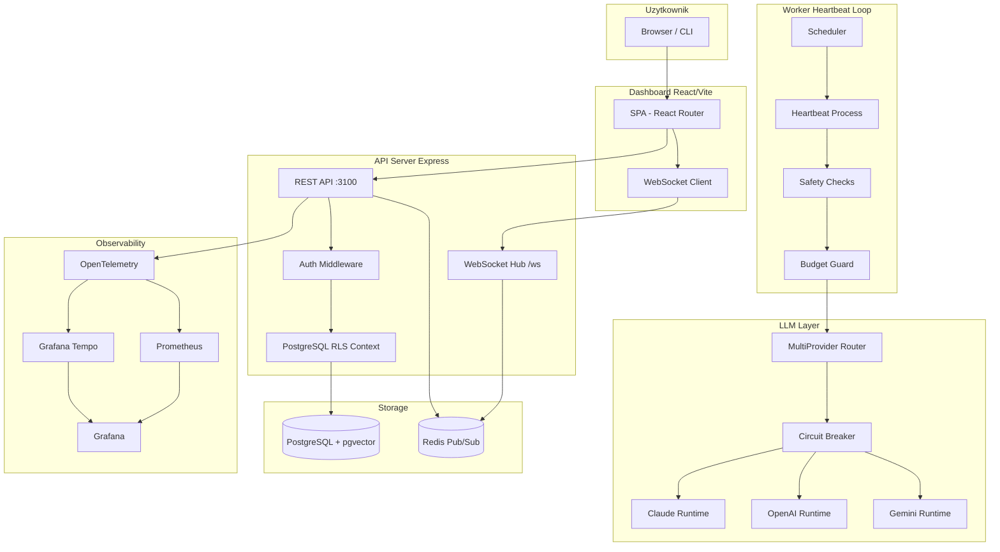

# 🏢 Pełny Audyt i Ocena — Autonomiczne Biuro

> Data audytu: 2026-03-20 | Audytor: Antigravity AI
> Repozytorium: `smietas123PL/Biuro` | Architektura: monorepo (pnpm workspaces)

---

## 1. Przegląd Ogólny

**Autonomiczne Biuro** to platforma do zarządzania wirtualną firmą zasilaną przez agentów AI. Użytkownik tworzy firmę, definiuje agentów (Claude / OpenAI / Gemini), przydziela im zadania i cele, a system autonomicznie wykonuje pracę w pętli heartbeat.

### Paczki w monorepo

| Pakiet | Opis | Technologia |
|--------|------|-------------|
| `@biuro/server` | API + Worker (heartbeat loop) | Express, TypeScript, PostgreSQL, Redis |
| `@biuro/dashboard` | Panel zarządzania | React 18, Vite, TailwindCSS |
| `@biuro/shared` | Typy i schematy wspólne | TypeScript |
| `@biuro/cli` | Narzędzie CLI | TypeScript |

---

## 2. Architektura — Diagram Przepływu



---

## 3. Ocena Komponentów

### 3.1 Serwer API (`@biuro/server`)

**Ocena: 8.5 / 10** ⭐⭐⭐⭐

#### ✅ Mocne strony

- **Walidacja env z Zod** ([env.ts](file:///c:/Users/User/Downloads/Biuro/packages/server/src/env.ts)) — wszystkie zmienne środowiskowe są walidowane przy starcie z sensownymi domyślnymi wartościami. Błędy konfiguracji wyrzucane są natychmiast.
- **Row-Level Security (RLS)** — PostgreSQL RLS z `app.current_company_id` i `app.current_user_id` zapewnia izolację danych per-firma na poziomie bazy danych (schemat v14). To architektura klasy enterprise.
- **Graceful shutdown** — sygnały SIGINT/SIGTERM poprawnie drenują połączenia HTTP, zamykają WebSocket, Redis, tracer OTEL i pulę DB z 10-sekundowym hard-timeout'em.
- **Separacja API i Workera** — serwer API i worker to osobne procesy. API nie wykonuje heartbeatów. Dobry separation of concerns.
- **Transakcje DB** — krytyczne operacje (tworzenie firmy, ustawienia runtime) są owiązane w transakcje z `db.transaction()`.
- **Rate limiting** — osobne limity dla: połączeń WS, wiadomości WS, broadcastów WS, oraz auth (przez `express-rate-limit`).

#### ⚠️ Słabe strony / Obszary do poprawy

- **`version: '1.0.0'` hardkodowane** (`/health`, `/api/health`) — nie pochodzi z [package.json](file:///c:/Users/User/Downloads/Biuro/package.json). Przy wersjonowaniu może być mylące.
- **[ws.ts](file:///c:/Users/User/Downloads/Biuro/packages/server/src/ws.ts) używa `x-forwarded-for`** bez weryfikacji zaufanego proxy — potencjalny IP spoofing jeśli serwer jest za anonimowym proxy.
- **`db.query` tworzy nowe połączenie dla każdego żądania z kontekstem** — przy dużym ruchu może być wąskim gardłem. Pool `max: 20` może być za mały dla produkcji.
- **Brak paginacji kursorowej** w niektórych endpointach — np. `/:id/activity-feed` używa prostego `LIMIT`.
- **Error handler** zwraca ogólny `'Internal server error'` — nie loguje `req.body` ani `req.query`.
- **Brak mechanizmu retry dla deadlock'ów DB** — transakcje nie są ponawiane.

---

### 3.2 Worker / Heartbeat

**Ocena: 9 / 10** ⭐⭐⭐⭐⭐

#### ✅ Mocne strony

- **Safety checks wielowarstwowe** ([safety.ts](file:///c:/Users/User/Downloads/Biuro/packages/server/src/orchestrator/safety.ts)):
  - Detekcja cyrkulacyjnych delegacji (DFS po `parent_id`)
  - Hard limit 60 heartbeatów/godzinę (niezależny od polityk)
  - Flood detection wiadomości (> 10/min)
  - Consecutive error detection (> 5/5min)
- **Circuit Breaker dla LLM** — [circuitBreaker.ts](file:///c:/Users/User/Downloads/Biuro/packages/server/src/runtime/circuitBreaker.ts) z konfigurowalnymi `FAILURE_THRESHOLD` i `COOLDOWN_MS`. Automatyczne przełączanie dostawców.
- **LLM Router z fallback chain** — `gemini → claude → openai` (konfigurowalny).
- **Auto-pause agenta** z powiadomieniem Slack/Discord i wpisem do audit_log.
- **Budget guard** — sprawdzenie budżetu miesięcznego przed każdym heartbeat'em.
- **Telemetria OTEL** na każdym span'ie (`worker.heartbeat`, `llm.router.attempt`).

#### ⚠️ Słabe strony

- **[detectCircularDelegation](file:///c:/Users/User/Downloads/Biuro/packages/server/src/orchestrator/safety.ts#52-68) wykonuje N zapytań DB** — możliwy atak wydajnościowy przy bardzo głębokiej hierarchii zadań.
- **`MAX_HEARTBEATS_PER_HOUR = 60` hardkodowane** — powinno być zmienną środowiskową.
- **Brak exponential backoff** w schedulerze — przy błędach agent jest natychmiast ponownie iterowany.

---

### 3.3 LLM Runtime

**Ocena: 8 / 10** ⭐⭐⭐⭐

#### ✅ Mocne strony

- Obsługa 3 dostawców: Claude (Anthropic), OpenAI, Gemini.
- Ujednolicony interfejs `IAgentRuntime` — łatwe dodawanie nowych dostawców.
- Per-firma konfiguracja primary runtime i fallback order.
- Structured response parsing z [structuredResponse.ts](file:///c:/Users/User/Downloads/Biuro/packages/server/src/runtime/structuredResponse.ts).

#### ⚠️ Słabe strony

- **Brak streaming support** — agenci czekają na pełną odpowiedź LLM. Dla długich odpowiedzi może powodować timeouty.
- **Model hardkodowany w schemacie DB**: `gemini-2.0-flash` jako default — może wymagać migracji przy nowych wersjach modeli.

---

### 3.4 Baza danych i Schematy

**Ocena: 9 / 10** ⭐⭐⭐⭐⭐

#### ✅ Mocne strony

- **14 migracji wersjonowanych** z systemem `migrationRunner` — solidna historia zmian.
- **pgvector** dla embeddings (wyszukiwanie semantyczne w bazie wiedzy).
- **Migracje startup** — server i worker automatycznie uruchamiają migracje przy starcie.
- **Full RLS** na wszystkich tabelach (v14) z funkcjami pomocniczymi.
- `SKIP LOCKED` przy checkout zadań — poprawna implementacja concurrent task queue.
- `updated_at` trigger dla głównych tabel.

#### ⚠️ Słabe strony

- **Brak widocznych indeksów** — zapytania jak `FROM heartbeats WHERE agent_id = $1 AND created_at > now() - interval '1 hour'` mogą być wolne bez composite index.
- **`tasks.created_by TEXT`** (zamiast UUID FK do `users`) — niespójność z resztą modelu danych.
- **`agent_sessions` bez TTL** — sesje agentów mogą rosnąć w nieskończoność.

---

### 3.5 Dashboard (React)

**Ocena: 7.5 / 10** ⭐⭐⭐⭐

#### ✅ Mocne strony

- **15 widoków funkcjonalnych** (Dashboard, Agents, Tasks, Goals, OrgChart, Budgets, Templates, Tools, Integrations, Observability, Audit, Approvals, Settings, Auth, AgentDetail, TaskDetail).
- **Code splitting** — wszystkie strony z `React.lazy()` i `Suspense`.
- **Error Boundary** na każdej trasie.
- **NetworkStatusBanner** — informuje o braku połączenia.
- **WebSocket real-time** — live updates bez pollingu.
- **Natural Language Command Panel** — unikalna funkcja tłumacząca komendy językowe na akcje.

#### ⚠️ Słabe strony

- **[TaskDetailPage.tsx](file:///c:/Users/User/Downloads/Biuro/packages/dashboard/src/pages/TaskDetailPage.tsx) (74KB)** i **[ToolsPage.tsx](file:///c:/Users/User/Downloads/Biuro/packages/dashboard/src/pages/ToolsPage.tsx) (57KB)** — bardzo duże komponenty, trudne w utrzymaniu.
- **[AgentDetailPage.tsx](file:///c:/Users/User/Downloads/Biuro/packages/dashboard/src/pages/AgentDetailPage.tsx) (48KB)** — podobny problem.
- **Brak globalnego store (Redux/Zustand)** — stan zarządzany lokalnie. Problem przy rosnącej skali.
- **Tailwind v3** — dostępna jest nowsza wersja v4.

---

### 3.6 Bezpieczeństwo

**Ocena: 8.5 / 10** ⭐⭐⭐⭐

#### ✅ Mocne strony

- **Helmet.js** z niestandardową konfiguracją CSP.
- **CORS** z whitelist `ALLOWED_ORIGINS`.
- **`x-powered-by` wyłączone**.
- **Rate limiting auth** (20 req/15min domyślnie).
- **WS auth** z weryfikacją sesji i roli per-firma.
- **RLS** jako ostatnia linia obrony — nawet jeśli aplikacja ma błąd, DB izoluje dane.
- **RBAC**: role `owner`, `admin`, `member`, `viewer` z różnymi uprawnieniami.
- **Raw body capture** dla weryfikacji webhooków (Stripe/Slack).

#### ⚠️ Słabe strony

- **Sesje jako plain tokens** w DB (bez JWT) — brak mechanizmu "revoke all sessions".
- **`AUTH_ENABLED: false`** przypisuje hardkodowane UUID `00000000...` — może maskować problemy w dev.
- **Brak CSRF protection** dla REST API — CORS nie jest wystarczający przy niektórych atakach.
- **Worker metryki na :9464** są niezabezpieczone.

---

### 3.7 Observability

**Ocena: 9.5 / 10** ⭐⭐⭐⭐⭐

#### ✅ Mocne strony

- **OpenTelemetry** z eksportem do Grafana Tempo przez OTEL Collector.
- **Prometheus + Grafana** dla metryk.
- **Custom metrics**: `activeHeartbeatsGauge`, `wsBroadcastEventsTotal`, `eventBusDeliveryMetric` itp.
- **Structured logging z Pino** — JSON logs z poziomami.
- **OTEL spans** na każdym heartbeat, LLM call, routing attempt.
- Pełny stack: Prometheus, Tempo, OTEL Collector, Grafana w docker-compose.

---

### 3.8 Testy

**Ocena: 8 / 10** ⭐⭐⭐⭐

#### ✅ Mocne strony

- **46 plików testowych** dla serwera z Vitest.
- Pokrycie: routes, runtimes, heartbeat, safety, DB migracje, WebSocket, embeddings, knowledge, templates.
- Testy e2e z Playwright.
- `pg-mem` dla testów bez rzeczywistej bazy danych.
- Dashboard ma testy per-strona.

#### ⚠️ Słabe strony

- Brak widocznych wyników pokrycia kodu.
- Dwie strategie e2e: [run_tests.mjs](file:///c:/Users/User/Downloads/Biuro/run_tests.mjs) (legacy) i Playwright — nakładają się.
- Brak testów load/performance.

---

### 3.9 Infrastruktura / DevOps

**Ocena: 8 / 10** ⭐⭐⭐⭐

#### ✅ Mocne strony

- **[docker-compose.yml](file:///c:/Users/User/Downloads/Biuro/docker-compose.yml)** z 9 serwisami: db, redis, server, worker, dashboard, prometheus, tempo, otel-collector, grafana.
- **Healthchecks** dla DB, server, dashboard.
- **`depends_on` z conditions** — prawidłowa kolejność startu.
- **Wolumeny trwałe** dla wszystkich stanowych serwisów.
- **[.env.example](file:///c:/Users/User/Downloads/Biuro/.env.example)** jako dokumentacja zmiennych.

#### ⚠️ Słabe strony

- **Redis bez auth** w docker-compose (brak `--requirepass`).
- **Prometheus na porcie 9090 otwarty** — w produkcji powinien być za auth proxy.
- **Brak Kubernetes manifests / Helm chart** — tylko docker-compose.
- **Worker metrics na stałym porcie 9464** — konflikty przy skalowaniu horyzontalnym.

---

## 4. Analiza Governance i RAG

### Governance (Policies + Approvals)

- 5 typów polityk: `approval_required`, `budget_threshold`, `delegation_limit`, `rate_limit`, `tool_restriction`.
- Mechanizm approval request/resolve z notyfikacjami.
- Polityki oceniane przed każdym heartbeat.

> [!WARNING]
> [evaluatePolicy](file:///c:/Users/User/Downloads/Biuro/packages/server/src/governance/policies.ts#10-105) wykonuje N zapytań do DB (jeden per politykę) bez buforowania. Przy dużej liczbie polityk może być wąskim gardłem.

### Knowledge Base (RAG)

- `company_knowledge` table z `pgvector`.
- Embeddings (OpenAI lub lokalne) z TTL cache.
- `retrieval_metrics` do śledzenia skuteczności wyszukiwania.

---

## 5. Podsumowanie Ocen

| Komponent | Ocena | Komentarz |
|-----------|-------|-----------|
| Architektura ogólna | **9/10** | Dojrzała, wielowarstwowa, dobrze podzielona |
| API Server | **8.5/10** | Solidny, brakuje drobnych ulepszeń |
| Worker/Heartbeat | **9/10** | Doskonały safety model, circuit breaker |
| LLM Runtime | **8/10** | Multi-provider, brak streamingu |
| Baza danych | **9/10** | RLS, pgvector, wersjonowane migracje |
| Dashboard | **7.5/10** | Bogate funkcje, ale giant components |
| Bezpieczeństwo | **8.5/10** | RLS + RBAC + Helmet, brak CSRF |
| Observability | **9.5/10** | Pelny OTEL stack, best-in-class |
| Testy | **8/10** | Dobra gęstość, brak coverage report |
| DevOps | **8/10** | Dobre docker-compose, brak K8s |
| **SREDNIA** | **8.55 / 10** | **Produkcyjnie gotowa platforma** |

---

## 6. Top 10 Rekomendacji (Priorytet)

### Krytyczne

1. **Dodaj indeksy DB** do często odpytywanych kolumn:

```sql
CREATE INDEX idx_heartbeats_agent_created ON heartbeats(agent_id, created_at DESC);
CREATE INDEX idx_tasks_assigned_status ON tasks(assigned_to, status);
CREATE INDEX idx_audit_log_company_created ON audit_log(company_id, created_at DESC);
```

2. **Redis auth w produkcji** — dodaj `--requirepass` do Redis i zaktualizuj `REDIS_URL`.

3. **Napraw wersję w `/health`** — odczytaj z [package.json](file:///c:/Users/User/Downloads/Biuro/package.json) lub zmiennej `APP_VERSION`.

### Ważne

4. **Podziel giant components** — [TaskDetailPage.tsx](file:///c:/Users/User/Downloads/Biuro/packages/dashboard/src/pages/TaskDetailPage.tsx) (74KB), [ToolsPage.tsx](file:///c:/Users/User/Downloads/Biuro/packages/dashboard/src/pages/ToolsPage.tsx) (57KB), [AgentDetailPage.tsx](file:///c:/Users/User/Downloads/Biuro/packages/dashboard/src/pages/AgentDetailPage.tsx) (48KB) na sub-komponenty max ~500 linii każdy.

5. **Dodaj CSRF protection** do REST API.

6. **Cache policyEvaluate** — buforuj polityki firmy w pamięci z krótkim TTL (np. 30s).

7. **`tasks.created_by`** — zmień z `TEXT` na `UUID REFERENCES users(id)`.

### Ulepszenia

8. **Dodaj globalny state manager** (Zustand) do dashboardu.

9. **LLM Streaming** — rozważ streaming odpowiedzi dla lepszego UX i redukcji timeoutów.

10. **Exponential backoff w schedulerze** — przy błędach heartbeat odczekaj rosnący czas przed ponowną próbą.

---

## 7. Pytania Biznesowe do Rozważenia

- **Multi-tenancy**: RLS jest jedyną barierą izolacji danych — warto rozważyć namespace isolation dla dużych klientów.
- **Billing**: `company_credits` i `billing_transactions` istnieją w schemacie, ale brak widocznej integracji z payment provider.
- **Limity**: brak globalnego limitu agentów per firma — czy to celowe?
- **GDPR/RODO**: `audit_log` przechowuje dane bez polityki retencji — warto dodać automatyczne czyszczenie po X dniach.

---

> **Podsumowanie:** Autonomiczne Biuro to **dojrzała, dobrze zaprojektowana platforma** z mocnymi fundamentami bezpieczenstwa (RLS, RBAC, circuit breaker, safety checks) i doskonalą observability. Główne obszary do poprawy: wydajnosc zapytan DB (brak indeksow), refaktoryzacja duzych komponentow frontendowych, oraz kilka luk bezpieczenstwa (Redis auth, CSRF). Platforma jest **gotowa do produkcji** z opisanymi usprawnieniami.
